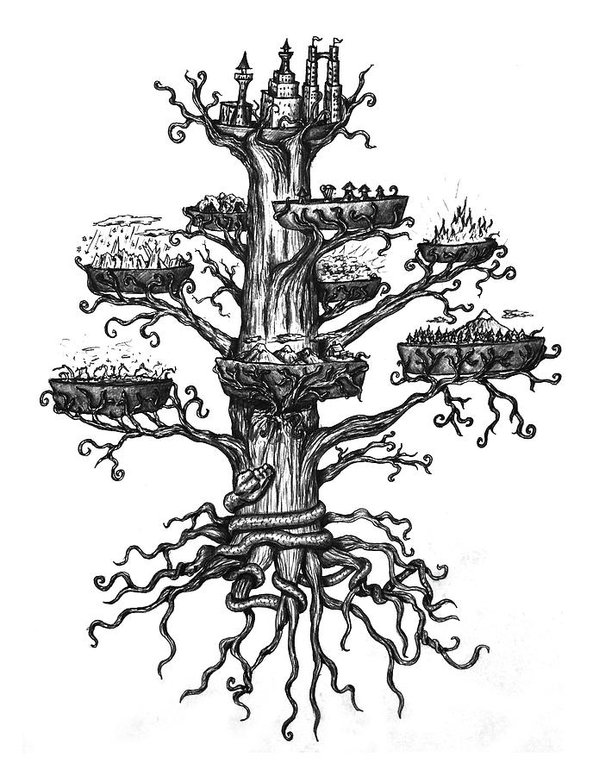
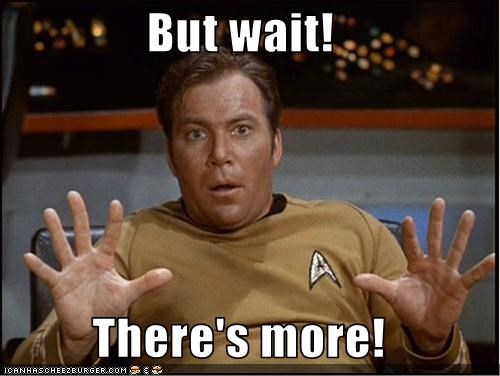
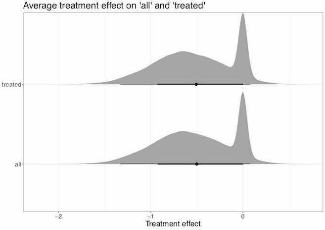

```{r setup, include=FALSE}
knitr::opts_chunk$set(echo = FALSE)
```


## *Heterogeneous treatment effects of early parenthood on later life mental health*
**Sara Kalucza**, University of Queensland | Umeå University

**Martin O'Flaherty**, University of Queensland

**Joshua Bon**, University of Queensland | Queensland University of Technology

## Background

- Detrimental effects of young parenthood: What do we know?
    - Many of the large detrimental effects identified in earlier litterature has been questioned and disproven
    - Persistent small effects on later life: *income*, *educational attainment*, and *health*.
<br><br>
- What is hiding behind average effects? 
    - There has been some previous investigation, eg, Xie, brand & Jann (2012),  Diaz & Fiel (2016)
<br><br>
- There are untapped methodological opportunities..

## Measuring heterogeneous treatment effects with BART

- Bayesian Additative Regression Trees
- Combines bayesian tree models with the use of backfitting via MCMC
- *developed by this and that person..*
- Implementation via BartMachine, supported by the purpose built TidyBayes package
 

## How it works - Tree based models

```{r tree, echo=FALSE, eval=TRUE, fig.align='center'}
knitr::include_graphics("images/single_tree.png")
```
<font size="1"> *Source: https://www.asc.ohio-state.edu/statistics/comp_exp/jour.club/trees.pdf * </font>


- Explains a little bit of the covariate space at the time


- Finds the best binary splits, with a coefficient for each terminal node


---
                    Many small trees > One large and complex tree



## Why BART 
- Naturaly handles interaction and nonlinearity, because of it's tree structure
- Avoids multiple comparison bias issues that arises with many interaction effects
- Throught the use of priors, the model will balance complexity in data and a simple fit = avoids overfitting,
    -  Provides an ready to use set of default priors that has been shown to be robust.


## 

```{r more, echo=FALSE, eval=TRUE, fig.align='center'}

```

- Large amount of covariated makes the *unconfoundedness assumption* more plausible: makes BART useful for average effects too

- Efficient in modeling *heterogeneity*: can be modeled in several ways, such as incorporating propensity scores


## Our Study
*Our aim is to estimate the effect of young parenthood on later life mental health, with special attention to heterogenous treatment effects.*

**Data: **

*The 1970 British Cohort Study (BCS70)* following the lives of 17000 children born during one week in Scotland & Wales.
Including 148 covariates spanning 14 domains such as

    - Education and aspirations
    
    - Socio economic background
    
    - Adolescent mental and physical health
    
    - Social Support, peers etc

## Treatment & Outcome

- **Treatment: Young mother**
    - Becoming a parent at age 22 or younger 
    - n = 2405 young mothers
    
- **Outcome: Mental wellbeing age 42 **
    - Edinbourugh-Warwick 14 item scale designed to measure mental wellbeing in the general population
    - Mean 50.0 for young parents and 47.5 for non young parents, sd 8.5

## Implementation 


**R Packages:** *machineBart*, *tidytreatment*
              
**tidytreatment details:**
- calculates *tidy* posterior summaries for Bayesian causal models in R. 

- Interfaces nicely with other packages in the tidyverse (e.g. ggplot2).
url: GitHub.com/bonstats/tidytreatment

**MCMC details**

    - 40,000 iterations + 10,000 burnin
  
    - Number of trees = 200


## Propensity by treatment, plot slide
- propensity score by treatment status, plot slide


## Results (hot of the press)
- Our model explains 19% of the variance in the outcome 
- The impact of becoming a young mother (ATE) was small, (-0.5)
- Very little heterogeneity in the effect
    
    ```{r dissapointed, echo=FALSE, eval=TRUE, fig.align='center'}
knitr::include_graphics("images/dissapointed.jpeg")
```

    
## Variable inclusion top

Treatment 99%

Propensity score 83%

1. Parental aspiration: Age CMs Mother thinks CM is going to leave school (age 10) (aspirations) 79%

2. SES background: Maternal Grandfather Social Class (age 10), 77%

3. SES background: Mothers year of schooling, 78%

4. Material affluence: Interviewer description home - luxiouriousness, 69%

5. Mental health: I think I am the wrong weight (age 16), 68% 

## Mean individual effects
```{r pte_avgs, echo=FALSE, eval=TRUE, fig.align='center'}

```

## Individual conditional treatment effects
```{r cates, echo=FALSE, eval=TRUE, fig.align='center'}
knitr::include_graphics("images/cate_ind.jpeg")
```

## Preliminary conclusions

- We can not find evidence of heterogeneity in the effects of early motherhood on later mental wellbeing
- There is a lot of unexplained variability, which is unsuprising
        
- We are very positive about the potentials of BART
- The model handeled large amounts of missigness well    
    
## References and further reading

Diaz, C. J., & Fiel, J. E. (2016). The Effect(s) of Teen Pregnancy: Reconciling Theory, Methods, and Findings. Demography, 53(1), 85–116. 
Xie, Y., Brand, J. E., & Jann, B. (2012). Estimating Heterogeneous Treatment Effects with Observational Data. Sociological Methodology, 42(1), 314–347.

Kapelner, A., & Bleich, J. (2016). bartMachine: Machine Learning with Bayesian Additive Regression Trees. Journal of Statistical Software, 70(4). https://doi.org/10.18637/jss.v070.i04
