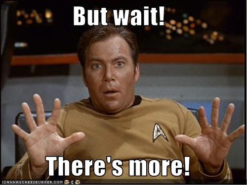

```{r setup, include=FALSE}
knitr::opts_chunk$set(echo = FALSE)
```


## *Heterogeneous treatment effects of early parenthood on later life mental health*
Sara Kalucza, University of Queensland | Umeå University

Martin O'Flaherty, University of Queensland

Joshua Bon, University of Queensland | Queensland University of Technology

## Background

- Detrimental effects of young parenthood: What do we know?
    - Many of the large detrimental effects identified in earlier litterature has been debunked.
    - Persistent small effects on later life: *income*, *educational attainment*, and *health*.
<br><br>
- What is hiding behind average effects? 
    - Some previous investigation... Brand / Diaz & Fiel
<br><br>
- There are untapped methodological opportunities..

## Measuring heterogeneous treatment effects with BART

- Bayesian Additative Regression Trees
- Combines bayesian tree models with the use of backfitting via MCMC
- *developed by this and that person..*
- Implementation via BartMachine, supported by the purpose built TidyBayes package
 

## How it works - Tree based models

- [Picture of acutal tree] explan how splitting works, nodes leafs etc. *How does a tree decide it's done?*


---
                    Many small trees > One large and complex tree


## Why BART 
- Naturaly handles interaction and nonlinearity, because of it's tree structure
- Avoids multiple comparison bias issues that arises with many interaction effects
- Throught the use of priors, the model will balance complexity in data and a simple fit = avoids overfitting,
    -  Provides an ready to use set of default priors that has been shown to be robust.


## 

```{r more, echo=FALSE, eval=TRUE, fig.align='center'}

```

- Large amount of covariated makes the *unconfoundedness assumption* more plausible: makes BART useful for average effects too

- Efficient in modeling *heterogeneity*: can be modeled in several ways, such as incorporating propensity scores


## Our Study
- Data: The 1970 British Cohort Study (BCS70) following the lives of 17000 children born during one week in Scotland & Wales.

### Aim: Our aim is to estimate the effect of young parenthood on later life mental health, with special attention to heterogenous treatment effects.

## Treatment & Outcome, plot slide
- Treatment: Becoming a parent at age 22 or younger
- Outcome: Mental health, measured with the Edinbourugh-Warwick scale, a 14 item scale design for mental wellbeing in the general population
- our treatment and outcome, plot-slides

## Preopensity by treatment, plot slide
- propensity score by treatment status, plot slide

## Results
- Variable importance, list or plots
- ATE, ATT - general benchmark 
(Plots show little heterogeneity)

## Preliminary conclusions and next steps

- There does not seems to be much heterogeneity in the effects, instead, there are small but homogeneous negative effects of teenage parenthood on later life mental health. 

- While teenage parenthood does not seem to be a catastrophic event for young people, it might lead to processes cumulative disadvantage that has long lasting effects. 

## References and further reading