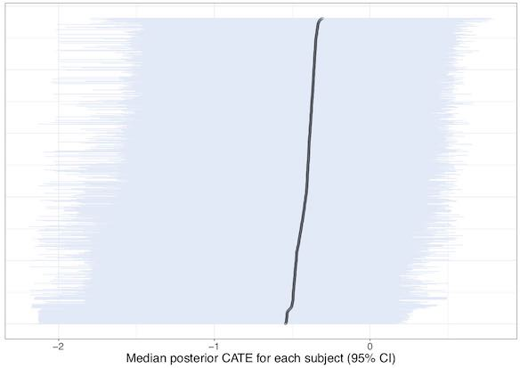

```{r setup, include=FALSE}
knitr::opts_chunk$set(echo = FALSE)
```


## *Heterogeneous treatment effects of early parenthood on later life mental health*
**Sara Kalucza**, </br><font size="4">University of Queensland | Umeå University </font>

**Martin O'Flaherty**,  </br><font size="4">University of Queensland</font>

**Joshua Bon**,  </br><font size="4">University of Queensland | Queensland University of Technology </font>

## Background

- Detrimental effects of young parenthood: What do we know?
    - Many of the large detrimental effects identified in earlier litterature has been questioned and disproven
    - Persistent small effects on later life outcomes
    - Focus has largely been on educational and labour market outcomes, not as much on wellbeing and health
<br><br>
- What is hiding behind average effects? 
    - There has been some previous investigation, </br> eg, Xie, Brand & Jann (2012),  Diaz & Fiel (2016)


## Measuring heterogeneous treatment effects with BART

- Bayesian Additative Regression Trees
- Combines Bayesian tree models with the use of backfitting via MCMC
- BART developed by Chipman, George & McCulloch (2010), and extended as a causal inference tool by Hill (2011)
- Implementation via bartMachine (2016), supported by the purpose built tidytreatment package
 

## How it works - Tree based models

```{r tree, echo=FALSE, eval=TRUE, fig.align='center'}

```
<font size="1"> *Source: https://www.asc.ohio-state.edu/statistics/comp_exp/jour.club/trees.pdf * </font>


- Explains a little bit of the covariate space at the time


- Finds the best binary splits, with a coefficient for each terminal node


---
                    Many small trees > One large and complex tree


## Why BART 

- Through the use of priors the model balances complexity in data and a simple fit = avoids overfitting,
    -  Provides an ready to use set of default priors that have been shown to be robust.
- Naturally handles interaction and nonlinearity, because of its tree structure
- Avoids multiple comparison bias issues that arise with many interaction effects


## 

```{r more, echo=FALSE, eval=TRUE, fig.align='center'}
knitr::include_graphics("images/more.jpeg")
```

- Large amount of covariates makes the *unconfoundedness assumption* more plausible: makes BART useful for average effects too

- Efficient in modelling *heterogeneity*: can be modelled in several ways, such as incorporating propensity scores


## Our Study
*Our aim is to estimate the effect of young parenthood on later life mental health, with special attention to heterogenous treatment effects.*

**Data: **

*The 1970 British Cohort Study (BCS70)* following the lives of children born during one week in Scotland & Wales.
Including 148 covariates spanning 14 domains such as

    - Education and aspirations
    
    - Socio-economic background
    
    - Adolescent mental and physical health
    
    - Social Support, peers etc

## Treatment & Outcome

- **Treatment: Young mother**
    - Becoming a parent at age 22 or younger 
    - Compared to (counterfactual) becoming a parent at age 23-29
    - n = 2405 young women, with 981 young mothers
    
- **Outcome: Mental wellbeing age 42 **
    - Warwick-Edinburgh 14 item scale designed to measure mental wellbeing in the general population
    - Mean 50.0 for young parents and 47.5 for non-young parents, sd 8.5

## Implementation 


**R Packages:** *bartMachine*, *tidytreatment*
              
**tidytreatment details:**

- calculates *tidy* posterior summaries for Bayesian causal models in R. 

- Interfaces nicely with other packages in the tidyverse (e.g. ggplot2).


**MCMC details**

  - 40,000 iterations (+ 10,000 burnin)
  
   - 200 trees in each iteration

## Results

- The impact of becoming a young mother (ATE) was small (-0.5)


<!-- ```{r pte_avgs, echo=FALSE, eval=TRUE, fig.align='center'} -->
<!-- knitr::include_graphics("images/pte_avgs.jpeg") -->
<!-- ``` -->

## Variable inclusion top

Propensity score, 99%

Becoming a young parent, 83%

1. Parental aspiration: Age *Individuals* Mother thinks *Individual* is going to leave school (age 10) (aspirations), 79%

2. SES background: Maternal Grandfather Social Class (age 10), 77%

3. SES background: Mothers year of schooling (age 5), 77%

4. Material affluence: Interviewer description home - luxuriousness (age 5), 69%

5. Mental health: I think I am the wrong weight (age 16), 68% 


## Individual conditional treatment effects
```{r cates, echo=FALSE, eval=TRUE, fig.align='center'}

```

## Individual conditional treatment effects

```{r dissapointed, echo=FALSE, eval=TRUE, fig.align='center'}

```


## Preliminary conclusions
**Substantive topic**

- There is a (very small) negative effect, is it substantially important?

- What is hiding behind the average effect? A consistently stable effect

- Limitation: Missingness in the age 16 covariates.

**Implementing BART**        

- We are very positive about the potentials of BART

- The model handeled large amounts of missingness well

- We see promises for BART for both average effects and heterogeneity in effects

    
## Thank You for Listening! 

<font size="4">Sara Kalucza, University of Queensland | Umeå University </br>
s.kalucza@uq.edu.au 

Martin O'Flaherty, University of Queensland

Joshua Bon, Queensland University of Technology | University of Queensland 


</br></br></br>
*This presentation is available at* https://skalucza.github.io/ESApresentation/
</font>

## References

<font size="4">
Chipman HA, George EI, McCulloch RE (2010). BART: Bayesian additive regression trees. The Annals of Applied Statistics. 1(4): 266–298

Diaz, C. J., & Fiel, J. E. (2016). The Effect(s) of Teen Pregnancy: Reconciling Theory, Methods, and Findings. Demography, 53(1), 85–116.

Hill JL. (2011) Bayesian nonparametric modeling for causal inference. Journal of Computational and Graphical Statistics. 1(20): 217–240.

Xie, Y., Brand, J. E., & Jann, B. (2012). Estimating Heterogeneous Treatment Effects with Observational Data. Sociological Methodology, 42(1), 314–347.

Kapelner, A., & Bleich, J. (2016). bartMachine: Machine Learning with Bayesian Additive Regression Trees. Journal of Statistical Software, 70(4). https://doi.org/10.18637/jss.v070.i04

**tidybayes package**: GitHub.com/bonstats/tidytreatment
</font>
